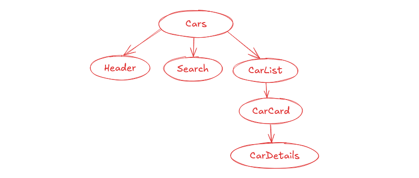
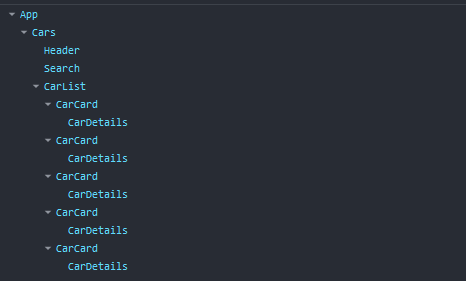

A project for completing given task.

## Step of the task:

- Draw a component hierarchy structure

- Make react component and match the component hierarchy in the React Dev Tool

- Screenshot of the UI

[fb](www.fb.com)
