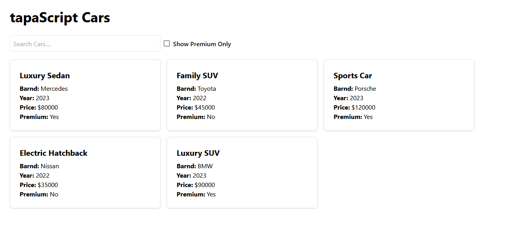

A project for completing given task.

## Step of the task:

- Draw a component hierarchy structure

- Make react component and match the component hierarchy in the React Dev Tool

- Screenshot of the UI

### Github repository link : [Github Repository](https://github.com/sojibkhan567/react-task-25)

### Application deploy link : [React-task](https://react-task-25-blond.vercel.app/)
